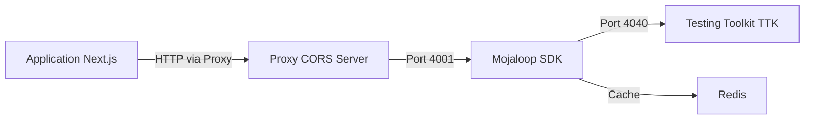

# Gbédagbé - Plateforme de Paiement de Pensions

Système de paiement de pensions avec authentification biométrique et intégration Mojaloop pour le hackathon DevLab 2025.

## 📋 Table des Matières

- [Architecture du Projet](#architecture-du-projet)
- [Prérequis](#prérequis)
- [Installation et Démarrage](#installation-et-démarrage)
- [Structure du Projet](#structure-du-projet)
- [Configuration](#configuration)
- [Utilisation](#utilisation)
- [Dépannage](#dépannage)

## 🏗️ Architecture du Projet

Le projet est composé de trois composants principaux :



### Composants

1. **Application Next.js** (`Hackaton_DevLab_ASIN/`) - Interface utilisateur avec :
   - Authentification biométrique (WebAuthn)
   - Agent conversationnel IA (Gemini)
   - Gestion des paiements de pensions
   - Portail administrateur et pensionnaires

2. **Mojaloop SDK + TTK** (`devlab sdk ttk/`) - Infrastructure de paiement :
   - **SDK Mojaloop** : Adaptateur de schéma pour les transferts
   - **Testing Toolkit (TTK)** : Simulateur de hub Mojaloop
   - **Proxy Server** : Serveur proxy CORS pour les requêtes cross-origin
   - **Redis** : Cache pour le SDK

## 🔧 Prérequis

Avant de commencer, assurez-vous d'avoir installé :

- **Node.js** (v18 ou supérieur)
- **npm** ou **yarn**
- **Docker** et **Docker Compose**
- **Git**

### Vérification des prérequis

```bash
node --version    # Doit afficher v18.x ou supérieur
npm --version     # Doit afficher 8.x ou supérieur
docker --version  # Doit afficher Docker version 20.x ou supérieur
docker-compose --version
```

## 🚀 Installation et Démarrage

### Étape 1 : Démarrer les Services Mojaloop (SDK + TTK)

Naviguez vers le dossier du SDK et démarrez les conteneurs Docker :

```bash
cd "devlab sdk ttk"
docker-compose up -d
```

Cette commande démarre :
- **ml-testing-toolkit** (ports 4040, 5050)
- **ml-testing-toolkit-ui** (port 6060)
- **mojaloop-connector-load-test** (SDK - ports 4000, 4001, 4002)
- **redis** (port 6379)

#### Vérification des services

Attendez environ 30-60 secondes pour que tous les services démarrent, puis vérifiez :

```bash
# Vérifier l'état des conteneurs
docker-compose ps

# Tester le SDK
curl http://localhost:4001/parties/MSISDN/22912345678
```

### Étape 2 : Démarrer le Proxy CORS

Le proxy permet à l'application Next.js de communiquer avec le SDK Mojaloop en contournant les restrictions CORS.

Dans le même dossier `devlab sdk ttk`, ouvrez un nouveau terminal :

```bash
node proxy-server.js
```

Le proxy démarre sur le **port 3001** et affiche :

```
╔══════════════════════════════════════════════════╗
║  🚀 PROXY CORS + RESTART MANAGER                 ║
╠══════════════════════════════════════════════════╣
║  Port: 3001                                      ║
║  POST /restart-all  → Restart TTK + SDK + Redis  ║
║  POST /restart-sdk  → Restart SDK only           ║
║  POST /flush-cache  → Flush Redis cache          ║
╚══════════════════════════════════════════════════╝
```

**⚠️ Important** : Laissez ce terminal ouvert pendant toute la durée d'utilisation de l'application.

### Étape 3 : Démarrer l'Application Next.js

Ouvrez un nouveau terminal et naviguez vers le dossier de l'application :

```bash
cd "Hackaton_DevLab_ASIN"
```

#### Installation des dépendances

```bash
npm install
```

#### Configuration de l'environnement

Créez un fichier `.env` à la racine du dossier `Hackaton_DevLab_ASIN` avec les variables suivantes :

```env
# Base de données
DATABASE_URL="file:./prisma/dev.db"

# API Gemini pour l'agent IA
GOOGLE_GENERATIVE_AI_API_KEY=votre_clé_api_gemini

# Configuration OpenAI-compatible pour Gemini
OPENAI_BASE_URL=https://generativelanguage.googleapis.com/v1beta/openai/
OPENAI_MODEL_NAME=gemini-2.5-flash

# URL du proxy Mojaloop
NEXT_PUBLIC_MOJALOOP_SDK_URL=http://localhost:3001

# Autres configurations (optionnel)
NEXT_PUBLIC_TTS_API_URL=http://votre-serveur-tts/api/tts
```

> **Note** : Obtenez votre clé API Gemini sur [Google AI Studio](https://makersuite.google.com/app/apikey)

#### Initialisation de la base de données

```bash
npm run build
```

Cette commande :
1. Génère le client Prisma
2. Crée/met à jour la base de données SQLite
3. Compile l'application Next.js

#### Démarrage du serveur de développement

```bash
npm run dev
```

L'application démarre sur **http://localhost:3000**

## 📁 Structure du Projet

```
final hack/
├── devlab sdk ttk/                    # Infrastructure Mojaloop
│   ├── docker-compose.yml             # Configuration Docker des services
│   ├── proxy-server.js                # Serveur proxy CORS (port 3001)
│   ├── mojaloop-connector-load-test.env  # Configuration du SDK
│   ├── configs/                       # Configurations TTK
│   └── secrets/                       # Clés JWS et certificats
│
└── Hackaton_DevLab_ASIN/             # Application Next.js
    ├── src/
    │   ├── app/                       # Pages et routes Next.js
    │   │   ├── api/                   # API routes
    │   │   ├── admin/                 # Portail administrateur
    │   │   └── pensioner/             # Portail pensionnaire
    │   ├── components/                # Composants React
    │   │   ├── chat/                  # Interface chatbot IA
    │   │   ├── auth/                  # Authentification biométrique
    │   │   └── ui/                    # Composants UI réutilisables
    │   └── lib/                       # Utilitaires et services
    │       ├── mojaloop.ts            # Client SDK Mojaloop
    │       └── prisma.ts              # Client base de données
    ├── prisma/
    │   ├── schema.prisma              # Schéma de base de données
    │   └── seed.ts                    # Données de test
    └── package.json
```

## ⚙️ Configuration

### Ports Utilisés

| Service | Port | Description |
|---------|------|-------------|
| Application Next.js | 3000 | Interface utilisateur principale |
| Proxy CORS | 3001 | Proxy pour requêtes vers SDK |
| SDK Inbound API | 4000 | API entrante Mojaloop |
| SDK Outbound API | 4001 | **API sortante (utilisée pour les transferts)** |
| SDK Test API | 4002 | API de test |
| TTK Backend | 4040 | Backend Testing Toolkit |
| TTK API | 5050 | API Testing Toolkit |
| TTK UI | 6060 | Interface web du TTK |
| Redis | 6379 | Cache du SDK |

### Variables d'Environnement Importantes

#### Application Next.js

- `DATABASE_URL` : Chemin vers la base de données SQLite
- `GOOGLE_GENERATIVE_AI_API_KEY` : Clé API pour l'agent IA Gemini
- `NEXT_PUBLIC_MOJALOOP_SDK_URL` : URL du proxy (http://localhost:3001)

#### SDK Mojaloop

Les configurations principales sont dans `mojaloop-connector-load-test.env` :

- `DFSP_ID=itk-load-test-dfsp` : Identifiant du DFSP
- `PEER_ENDPOINT=ml-testing-toolkit:4040` : Endpoint du TTK
- `AUTO_ACCEPT_QUOTES=true` : Acceptation automatique des devis
- `AUTO_ACCEPT_PARTY=true` : Acceptation automatique des parties

## 💡 Utilisation

### Accès aux Interfaces

1. **Application principale** : http://localhost:3000
2. **TTK UI** (interface de test) : http://localhost:6060
3. **Proxy status** : http://localhost:3001/status

### Comptes de Test

Après l'initialisation de la base de données, vous pouvez utiliser :

- **Admin** : Accès au portail d'administration pour autoriser les paiements en masse
- **Pensionnaires** : Consultez `prisma/seed.ts` pour les comptes de test

### Tester les Transferts Mojaloop

#### Lookup d'un compte

```bash
curl http://localhost:4001/parties/MSISDN/22912345678 | jq .
```

#### Effectuer un transfert

```bash
curl -X POST \
  http://localhost:4001/transfers \
  -H 'Content-Type: application/json' \
  -H 'Accept: application/json' \
  -d '{
    "from": {
        "displayName": "John Doe",
        "idType": "MSISDN", 
        "idValue": "123456789"
    },
    "to": {
        "idType": "PERSONAL_ID",
        "idValue": "22912345678"
    },
    "amountType": "SEND",
    "currency": "XOF",
    "amount": "100",
    "transactionType": "TRANSFER",
    "note": "testpayment",
    "homeTransactionId": "test-'$(date +%s)'"
  }' | jq .
```

### Flux de Travail Typique

1. **Admin** : Se connecte et télécharge un fichier CSV de paiements
2. **Système** : Valide le CSV et prépare les transferts
3. **Admin** : Autorise les paiements en masse
4. **Système** : Exécute les transferts via Mojaloop SDK
5. **Pensionnaire** : Reçoit une notification et peut retirer via mobile money

## 🔧 Dépannage

### Les conteneurs Docker ne démarrent pas

```bash
# Vérifier les logs
cd "devlab sdk ttk"
docker-compose logs

# Redémarrer tous les services
docker-compose down
docker-compose up -d
```

### Le SDK ne répond pas

```bash
# Redémarrer uniquement le SDK via le proxy
curl -X POST http://localhost:3001/restart-sdk

# Ou redémarrer tous les conteneurs
curl -X POST http://localhost:3001/restart-all
```

### Vider le cache Redis

```bash
curl -X POST http://localhost:3001/flush-cache
```

### Erreurs CORS

Assurez-vous que :
1. Le proxy CORS est bien démarré (`node proxy-server.js`)
2. La variable `NEXT_PUBLIC_MOJALOOP_SDK_URL` pointe vers http://localhost:3001

### Erreurs de base de données

```bash
cd "Hackaton_DevLab_ASIN"

# Régénérer la base de données
rm prisma/dev.db
npm run build
```

### L'application Next.js ne démarre pas

```bash
# Nettoyer et réinstaller
rm -rf node_modules .next
npm install
npm run dev
```

## 📚 Ressources

- [Documentation Mojaloop](https://docs.mojaloop.io/)
- [API FSPIOP](https://docs.mojaloop.io/api/fspiop/v1.1/api-definition.html)
- [Next.js Documentation](https://nextjs.org/docs)
- [Prisma Documentation](https://www.prisma.io/docs)
- [WebAuthn Guide](https://webauthn.guide/)

## 🎯 Fonctionnalités Principales

- ✅ Authentification biométrique (WebAuthn)
- ✅ Agent conversationnel IA multilingue (Français/Fon)
- ✅ Paiements en masse via Mojaloop
- ✅ Portail administrateur pour gestion des pensions
- ✅ Portail pensionnaire pour consultation et retrait
- ✅ Intégration mobile money
- ✅ Gestion asynchrone des transferts
- ✅ Interface de test TTK

## 📝 Notes Importantes

1. **Ordre de démarrage** : Toujours démarrer dans l'ordre : Docker → Proxy → Next.js
2. **Proxy CORS** : Ne pas fermer le terminal du proxy pendant l'utilisation
3. **Base de données** : SQLite en développement, PostgreSQL recommandé en production
4. **Sécurité** : Les configurations actuelles sont pour le développement uniquement

---

**Projet Gbédagbé - Développé pour le DevLab 2025 Hackathon** 🚀
